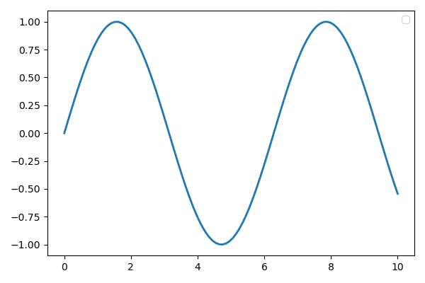
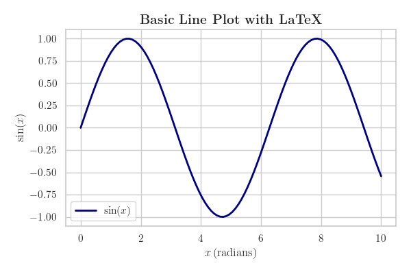

I have been trying to come up with good ways of producing high-quality visualizations for research papers and presentations. While there may be specific requirements from publishers and personal preferences, I have always grappled with understanding what constitutes a *good* visualization.  

In this post, I’ll attempt to develop my personal thesis (or brand) of what makes a plot, chart, or figure effective. Along the way, I’ll demonstrate how to produce publication-ready plots in **Python** using **Matplotlib** and **Seaborn**.

---

## 1. Why Good Visualizations Matter

- **Clarity**: A figure should communicate the key idea at a glance.  
- **Reproducibility**: The same data should always produce the same figure.  
- **Aesthetics**: A clean, professional look ensures your audience takes the results seriously.  
- **Compliance**: Many journals have strict formatting rules (font size, DPI, file formats).  

---

## 2. Getting Started with Matplotlib, Seaborn, and LaTeX Fonts

We will use Matplotlib for fine-grained control and Seaborn for aesthetics and statistical plots.  
Let us start with a basic matplotlib plot


```python 
import matplotlib.pyplot as plt
import seaborn as sns
import numpy as np
import pandas as pd


```

---


## 3. A Simple Line Plot (Matplotlib)

```python
# Data
x = np.linspace(0, 10, 100)
y = np.sin(x)

plt.figure(figsize=(6,4))
plt.plot(x, y, label=r"$\sin(x)$", linewidth=2, color="navy")

plt.xlabel(r"$x \, (\mathrm{radians})$")
plt.ylabel(r"$\sin(x)$")
plt.title(r"\textbf{Basic Line Plot with LaTeX}", fontsize=14)
plt.legend()
plt.tight_layout()
plt.show()
```



---

## 4. Adding LaTeX and Customizations
To render **LaTeX-style text** (e.g., equations, Greek letters, math symbols), we enable `text.usetex` and add customizations using rCParams.

```python 
# Apply a clean Seaborn theme
sns.set_theme(style="whitegrid", font_scale=1.2)

# Enable LaTeX rendering in Matplotlib
plt.rcParams.update({
    "text.usetex": True,
    "font.family": "serif",
    "axes.labelsize": 12,
    "axes.titlesize": 14,
    "legend.fontsize": 11,
    "xtick.labelsize": 11,
    "ytick.labelsize": 11,
})

x = np.linspace(0, 10, 100)
y = np.sin(x)

plt.figure(figsize=(6,4))
plt.plot(x, y, label=r"$\sin(x)$", linewidth=2, color="navy")

plt.xlabel(r"$x \; (\mathrm{radians})$")
plt.ylabel(r"$\sin(x)$")
plt.title(r"\textbf{Basic Line Plot with LaTeX}", fontsize=14)
plt.legend()
plt.tight_layout()
plt.show()

```



---

## 5. Adding Aesthetics with Seaborn

Seaborn builds on Matplotlib and provides a more modern look.

```python
# Example dataset
tips = sns.load_dataset("tips")

plt.figure(figsize=(6,4))
sns.scatterplot(data=tips, x="total_bill", y="tip", hue="time", style="sex", s=80)

plt.title(r"\textbf{Tips Dataset: Total Bill vs Tip}")
plt.xlabel(r"Total Bill (\$)")
plt.ylabel(r"Tip (\$)")
plt.tight_layout()
plt.show()
```

---

## 6. Saving High-Resolution Figures

For journals and conferences, always save plots at **≥300 DPI** and preferably in **vector formats** like PDF or SVG.

```python
plt.figure(figsize=(6,4), dpi=300)
plt.plot(x, y, label=r"$\sin(x)$", linewidth=2, color="darkred")

plt.xlabel(r"$x$")
plt.ylabel(r"$\sin(x)$")
plt.title(r"\textbf{High-Resolution Plot}", fontsize=14)
plt.legend()
plt.tight_layout()

# Save as PNG and PDF
plt.savefig("publication_plot.png", dpi=300, bbox_inches="tight")
plt.savefig("publication_plot.pdf", bbox_inches="tight")
plt.show()
```

---

## 7. Multiple Subplots

Often, you may want to compare results side-by-side.

```python
fig, axes = plt.subplots(1, 2, figsize=(10,4), dpi=300)

# Sine
axes[0].plot(x, np.sin(x), label=r"$\sin(x)$", color="blue")
axes[0].set_title(r"\textbf{Sine Function}")
axes[0].legend()

# Cosine
axes[1].plot(x, np.cos(x), label=r"$\cos(x)$", color="green")
axes[1].set_title(r"\textbf{Cosine Function}")
axes[1].legend()

plt.tight_layout()
plt.savefig("subplots.png", dpi=300, bbox_inches="tight")
plt.show()
```

---

## 8. Statistical Plots with Seaborn

Seaborn makes statistical visualisation effortless.

```python
plt.figure(figsize=(6,4))
sns.boxplot(data=tips, x="day", y="total_bill", palette="Set2")
sns.swarmplot(data=tips, x="day", y="total_bill", color=".25")

plt.title(r"\textbf{Total Bill Distribution by Day}")
plt.xlabel(r"Day of the Week")
plt.ylabel(r"Total Bill (\$)")
plt.tight_layout()
plt.show()
```

---

## 9. Scientific Example with Equations

In many papers, you’ll want to include **scientific equations** directly in your plots.  
Here’s an example where we plot an exponential decay and annotate it with LaTeX.

```python
# Data
x = np.linspace(0, 5, 100)
y = np.exp(-x)

plt.figure(figsize=(6,4))
plt.plot(x, y, label=r"$y = e^{-x}$", linewidth=2, color="purple")

plt.xlabel(r"$x \, (\mathrm{seconds})$")
plt.ylabel(r"$y(x) = e^{-x}$")
plt.title(r"\textbf{Exponential Decay: } $y = e^{-x}$")
plt.legend()

# Add inline equation annotation
plt.text(2.5, 0.4, r"$E = mc^2$", fontsize=12, color="black")

plt.tight_layout()
plt.show()
```

---

## 10. Example with Units in Axis Labels

Engineering and physics papers often include units explicitly in plots.  
LaTeX makes it easy to display them in a clean format.

```python
# Volume vs Pressure example
V = np.linspace(0.1, 10, 100)
P = 8.314 / V  # Just an illustrative equation

plt.figure(figsize=(6,4))
plt.plot(V, P, linewidth=2, color="darkorange", label=r"$P = \frac{nRT}{V}$")

plt.xlabel(r"Volume $V \, [\mathrm{m^3}]$")
plt.ylabel(r"Pressure $P \, [\mathrm{Pa}]$")
plt.title(r"\textbf{Pressure-Volume Relationship}")
plt.legend()
plt.tight_layout()
plt.show()
```

---

## 11. Best Practices for Publication-Ready Figures

- Use **vector formats (PDF, EPS, SVG)** when possible.  
- Explicitly set **figure size** (`figsize=(width, height)`).  
- Use readable fonts (≥10 pt), thicker lines (≥1.5 pt), and distinct markers.  
- Keep figures **uncluttered**—less is more.  
- Maintain **consistency** in font, size, and colours across all figures.  
- Always save with **tight bounding boxes** (`bbox_inches="tight"`).  
- Follow the **specific journal or conference guidelines**.  
- Use **LaTeX rendering** for mathematical symbols, units, and styled labels.  

---

## 12. Conclusion

Matplotlib and Seaborn provide all the flexibility you need to generate beautiful, professional-quality plots. With thoughtful design choices—clarity, readability, consistency—you can elevate your figures from basic charts to publication-ready visuals.  

In particular, enabling **LaTeX rendering** ensures your plots look consistent with the mathematical notation in your paper, keeping everything professional and polished.

---

✦ This is **Part 1** in a series. In upcoming posts, I’ll dive deeper into advanced customization, colour palettes, LaTeX integration tricks (inline vs block), and preparing figures for different publishers.
